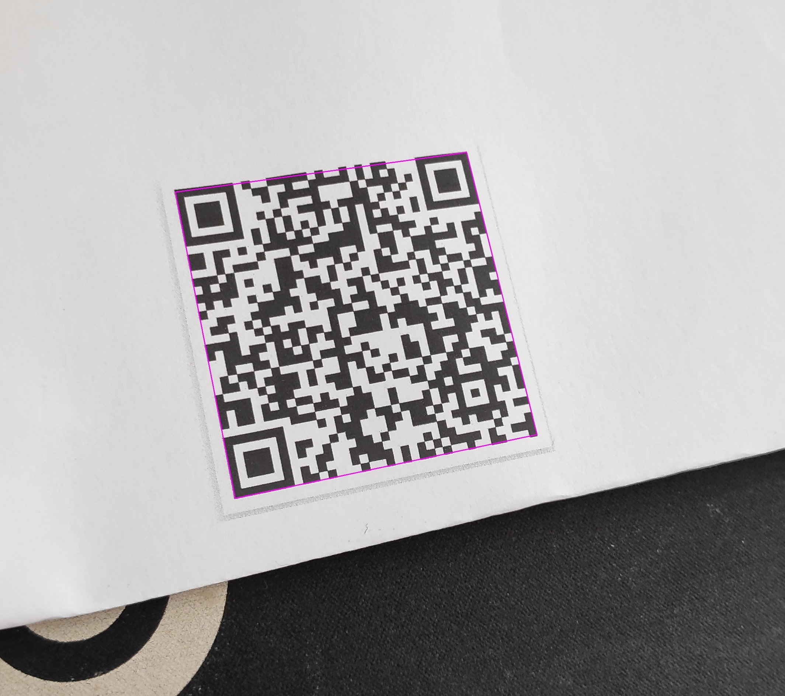

# Python QR Code detector
This program detects QR Code on picture, decodes its message and draws a rectangle around QR Code.   
  
Then it extracts "SN" value from QR data.  
The recognized QR Code is saved as new file within location of the input file.  
Serial Number is saved to text file in root directory "SerialNumber.txt".
## Installation
Navigate to desired folder and then execute:
```
git clone https://github.com/latosmichal/Py4QR.git
cd Py4QR
python -m venv .venv
.venv\Scripts\activate
pip install -r requirements.txt
```
## Running
<<<<<<< HEAD
You can use as many image files as you want.  
```
python FindSerialNumbers.py testImages\1.jpg testImages\TEST4.jpg
```
Alternatively, you can run the app on all test images in testImages folder:  
Just run:
```
python FindSerialNumbers.py
```
=======
To run the script feed images paths as arguments.  
You can use as many image files as you want.  
In cmd, execute command:
```
python FindSerialNumbers.py image1 image2 image3 ...
```
To run test data, execute:
```
python FindSerialNumbers.py testImages\1.jpg testImages\TEST4.jpg
```
